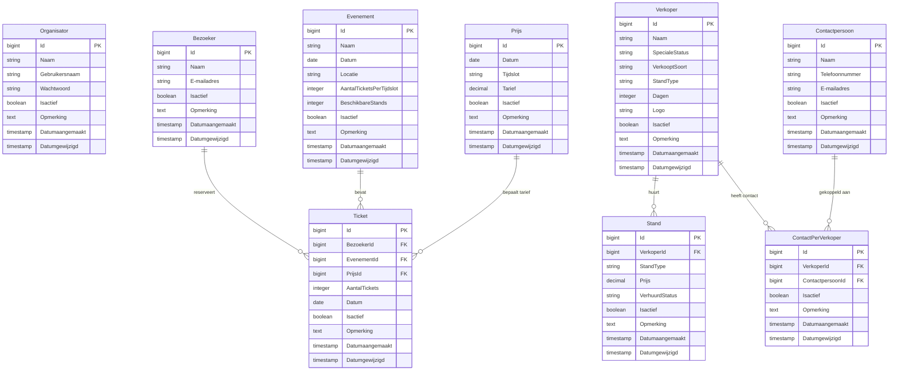

# ERD en Specificatietabellen - Sneakerness Rotterdam (VierkanteWielen)

## 1. Entity Relationship Diagram (ERD)

---

## 2. Specificatietabellen (3NF Normalisatie)

### Tabel: `organisators`
| Veldnaam | Datatype | Constraints | Omschrijving |
|---|---|---|---|
| `Id` | `BIGINT` | `PK, AUTO_INCREMENT` | Uniek id van organisator |
| `Naam` | `VARCHAR(255)` | `NOT NULL` | Volledige naam |
| `Gebruikersnaam` | `VARCHAR(255)` | `NOT NULL, UNIQUE` | Login gebruikersnaam |
| `Wachtwoord` | `VARCHAR(255)` | `NOT NULL` | Gehasht wachtwoord (Bcrypt) |
| `Isactief` | `TINYINT(1)` | `DEFAULT 1` | Systeemveld status |
| `Opmerking` | `TEXT` | `NULLABLE` | Systeemveld opmerking |
| `Datumaangemaakt`| `TIMESTAMP` | `DEFAULT CURRENT_TIMESTAMP` | Systeemveld aanmaakdatum |
| `Datumgewijzigd` | `TIMESTAMP` | `DEFAULT CURRENT_TIMESTAMP ON UPDATE` | Systeemveld wijzigingsdatum |

### Tabel: `bezoekers`
| Veldnaam | Datatype | Constraints | Omschrijving |
|---|---|---|---|
| `Id` | `BIGINT` | `PK, AUTO_INCREMENT` | Uniek id bezoeker |
| `Naam` | `VARCHAR(255)` | `NOT NULL` | Volledige naam bezoeker |
| `E-mailadres` | `VARCHAR(255)` | `NOT NULL` | E-mailadres bezoeker |
| `Isactief` | `TINYINT(1)` | `DEFAULT 1` | Systeemveld status |
| `Opmerking` | `TEXT` | `NULLABLE` | Systeemveld opmerking |
| `Datumaangemaakt`| `TIMESTAMP` | `DEFAULT CURRENT_TIMESTAMP` | Systeemveld aanmaakdatum |
| `Datumgewijzigd` | `TIMESTAMP` | `DEFAULT CURRENT_TIMESTAMP ON UPDATE` | Systeemveld wijzigingsdatum |

### Tabel: `evenements`
| Veldnaam | Datatype | Constraints | Omschrijving |
|---|---|---|---|
| `Id` | `BIGINT` | `PK, AUTO_INCREMENT` | Uniek id evenement |
| `Naam` | `VARCHAR(255)` | `NOT NULL` | Naam van het evenement |
| `Datum` | `DATE` | `NOT NULL` | Datum van evenement |
| `Locatie` | `VARCHAR(255)` | `NOT NULL` | Beurslocatie |
| `AantalTicketsPerTijdslot` | `INT` | `DEFAULT 100` | Capaciteit per entreetijd |
| `BeschikbareStands` | `INT` | `DEFAULT 50` | Beschikbaar aantal stands |
| `Isactief` | `TINYINT(1)` | `DEFAULT 1` | Systeemveld status |
| `Opmerking` | `TEXT` | `NULLABLE` | Systeemveld opmerking |
| `Datumaangemaakt`| `TIMESTAMP` | `DEFAULT CURRENT_TIMESTAMP` | Systeemveld aanmaakdatum |
| `Datumgewijzigd` | `TIMESTAMP` | `DEFAULT CURRENT_TIMESTAMP ON UPDATE` | Systeemveld wijzigingsdatum |

### Tabel: `prijs`
| Veldnaam | Datatype | Constraints | Omschrijving |
|---|---|---|---|
| `Id` | `BIGINT` | `PK, AUTO_INCREMENT` | Uniek id prijsklasse |
| `Datum` | `DATE` | `NOT NULL` | Geldigheidsdatum |
| `Tijdslot` | `VARCHAR(255)` | `NOT NULL` | Tijdslot omschrijving |
| `Tarief` | `DECIMAL(8,2)` | `NOT NULL` | Prijs per ticket |
| `Isactief` | `TINYINT(1)` | `DEFAULT 1` | Systeemveld status |
| `Opmerking` | `TEXT` | `NULLABLE` | Systeemveld opmerking |
| `Datumaangemaakt`| `TIMESTAMP` | `DEFAULT CURRENT_TIMESTAMP` | Systeemveld aanmaakdatum |
| `Datumgewijzigd` | `TIMESTAMP` | `DEFAULT CURRENT_TIMESTAMP ON UPDATE` | Systeemveld wijzigingsdatum |

### Tabel: `tickets`
| Veldnaam | Datatype | Constraints | Omschrijving |
|---|---|---|---|
| `Id` | `BIGINT` | `PK, AUTO_INCREMENT` | Uniek id ticket |
| `BezoekerId` | `BIGINT` | `FK -> bezoekers(Id)` | FK bezoeker |
| `EvenementId` | `BIGINT` | `FK -> evenements(Id)` | FK evenement |
| `PrijsId` | `BIGINT` | `FK -> prijs(Id)` | FK prijsklasse |
| `AantalTickets` | `INT` | `DEFAULT 1` | Aantal gekochte kaarten |
| `Datum` | `DATE` | `NOT NULL` | Bezoekdatum |
| `Isactief` | `TINYINT(1)` | `DEFAULT 1` | Systeemveld status |
| `Opmerking` | `TEXT` | `NULLABLE` | Systeemveld opmerking |
| `Datumaangemaakt`| `TIMESTAMP` | `DEFAULT CURRENT_TIMESTAMP` | Systeemveld aanmaakdatum |
| `Datumgewijzigd` | `TIMESTAMP` | `DEFAULT CURRENT_TIMESTAMP ON UPDATE` | Systeemveld wijzigingsdatum |

### Tabel: `verkopers`
| Veldnaam | Datatype | Constraints | Omschrijving |
|---|---|---|---|
| `Id` | `BIGINT` | `PK, AUTO_INCREMENT` | Uniek id verkoper |
| `Naam` | `VARCHAR(255)` | `NOT NULL` | Bedrijfs- / Shopnaam |
| `SpecialeStatus` | `VARCHAR(100)` | `DEFAULT 'Normaal'` | Partner status |
| `VerkooptSoort` | `VARCHAR(255)` | `NOT NULL` | Type producten |
| `StandType` | `VARCHAR(50)` | `NOT NULL` | Gewenst standtype (AA+, AA, A) |
| `Dagen` | `INT` | `DEFAULT 1` | Aantal dagen huur (1 of 2) |
| `Logo` | `VARCHAR(255)` | `NULLABLE` | Bestandsnaam logo |
| `Isactief` | `TINYINT(1)` | `DEFAULT 1` | Systeemveld status |
| `Opmerking` | `TEXT` | `NULLABLE` | Systeemveld opmerking |
| `Datumaangemaakt`| `TIMESTAMP` | `DEFAULT CURRENT_TIMESTAMP` | Systeemveld aanmaakdatum |
| `Datumgewijzigd` | `TIMESTAMP` | `DEFAULT CURRENT_TIMESTAMP ON UPDATE` | Systeemveld wijzigingsdatum |

### Tabel: `stands`
| Veldnaam | Datatype | Constraints | Omschrijving |
|---|---|---|---|
| `Id` | `BIGINT` | `PK, AUTO_INCREMENT` | Uniek id stand |
| `VerkoperId` | `BIGINT` | `FK -> verkopers(Id)` | FK verkoper |
| `StandType` | `VARCHAR(50)` | `NOT NULL` | Standtype (AA+, AA, A) |
| `Prijs` | `DECIMAL(8,2)` | `NOT NULL` | Huurprijs stand |
| `VerhuurdStatus` | `VARCHAR(50)` | `DEFAULT 'Beschikbaar'` | Status (Verhuurd / Beschikbaar) |
| `Isactief` | `TINYINT(1)` | `DEFAULT 1` | Systeemveld status |
| `Opmerking` | `TEXT` | `NULLABLE` | Systeemveld opmerking |
| `Datumaangemaakt`| `TIMESTAMP` | `DEFAULT CURRENT_TIMESTAMP` | Systeemveld aanmaakdatum |
| `Datumgewijzigd` | `TIMESTAMP` | `DEFAULT CURRENT_TIMESTAMP ON UPDATE` | Systeemveld wijzigingsdatum |

### Tabel: `contactpersoons`
| Veldnaam | Datatype | Constraints | Omschrijving |
|---|---|---|---|
| `Id` | `BIGINT` | `PK, AUTO_INCREMENT` | Uniek id contactpersoon |
| `Naam` | `VARCHAR(255)` | `NOT NULL` | Volledige naam |
| `Telefoonnummer` | `VARCHAR(50)` | `NOT NULL` | Telefoonnummer |
| `E-mailadres` | `VARCHAR(255)` | `NOT NULL` | E-mailadres |
| `Isactief` | `TINYINT(1)` | `DEFAULT 1` | Systeemveld status |
| `Opmerking` | `TEXT` | `NULLABLE` | Systeemveld opmerking |
| `Datumaangemaakt`| `TIMESTAMP` | `DEFAULT CURRENT_TIMESTAMP` | Systeemveld aanmaakdatum |
| `Datumgewijzigd` | `TIMESTAMP` | `DEFAULT CURRENT_TIMESTAMP ON UPDATE` | Systeemveld wijzigingsdatum |

### Tabel: `contact_per_verkopers`
| Veldnaam | Datatype | Constraints | Omschrijving |
|---|---|---|---|
| `Id` | `BIGINT` | `PK, AUTO_INCREMENT` | Uniek id koppeltabel |
| `VerkoperId` | `BIGINT` | `FK -> verkopers(Id)` | FK verkoper |
| `ContactpersoonId` | `BIGINT` | `FK -> contactpersoons(Id)` | FK contactpersoon |
| `Isactief` | `TINYINT(1)` | `DEFAULT 1` | Systeemveld status |
| `Opmerking` | `TEXT` | `NULLABLE` | Systeemveld opmerking |
| `Datumaangemaakt`| `TIMESTAMP` | `DEFAULT CURRENT_TIMESTAMP` | Systeemveld aanmaakdatum |
| `Datumgewijzigd` | `TIMESTAMP` | `DEFAULT CURRENT_TIMESTAMP ON UPDATE` | Systeemveld wijzigingsdatum |
