# UML Klassendiagram - Sneakerness Rotterdam (VierkanteWielen)

Het onderstaande UML Klassendiagram toont de MVC-architectuur van het project met de Controllers, Models en hun onderlinge relaties.

```mermaid
classDiagram
    class HomeController {
        +index() View
        +dashboard() View
    }

    class TicketController {
        +index() View
        +create() View
        +store(Request request) RedirectResponse
        +destroy(int id) RedirectResponse
    }

    class VerkoperController {
        +index() View
        +create() View
        +store(Request request) RedirectResponse
        +destroy(int id) RedirectResponse
    }

    class StandController {
        +index() View
        +create() View
        +store(Request request) RedirectResponse
        +destroy(int id) RedirectResponse
    }

    class EventController {
        +index() View
        +create() View
        +store(Request request) RedirectResponse
        +update(Request request, int id) RedirectResponse
        +destroy(int id) RedirectResponse
    }

    class ContactpersoonController {
        +index() View
        +create() View
        +store(Request request) RedirectResponse
        +destroy(int id) RedirectResponse
    }

    class Organisator {
        +int Id
        +string Naam
        +string Gebruikersnaam
        +string Wachtwoord
        +bool Isactief
    }

    class Bezoeker {
        +int Id
        +string Naam
        +string E-mailadres
        +bool Isactief
        +tickets() HasMany
    }

    class Evenement {
        +int Id
        +string Naam
        +date Datum
        +string Locatie
        +int AantalTicketsPerTijdslot
        +int BeschikbareStands
        +bool Isactief
        +tickets() HasMany
    }

    class Prijs {
        +int Id
        +date Datum
        +string Tijdslot
        +decimal Tarief
        +bool Isactief
        +tickets() HasMany
    }

    class Ticket {
        +int Id
        +int BezoekerId
        +int EvenementId
        +int PrijsId
        +int AantalTickets
        +date Datum
        +bool Isactief
        +bezoeker() BelongsTo
        +evenement() BelongsTo
        +prijs() BelongsTo
    }

    class Verkoper {
        +int Id
        +string Naam
        +string SpecialeStatus
        +string VerkooptSoort
        +string StandType
        +int Dagen
        +string Logo
        +bool Isactief
        +stands() HasMany
        +contactpersoons() BelongsToMany
    }

    class Stand {
        +int Id
        +int VerkoperId
        +string StandType
        +decimal Prijs
        +string VerhuurdStatus
        +bool Isactief
        +verkoper() BelongsTo
    }

    class Contactpersoon {
        +int Id
        +string Naam
        +string Telefoonnummer
        +string E-mailadres
        +bool Isactief
        +verkopers() BelongsToMany
    }

    class ContactPerVerkoper {
        +int Id
        +int VerkoperId
        +int ContactpersoonId
        +bool Isactief
        +verkoper() BelongsTo
        +contactpersoon() BelongsTo
    }

    TicketController ..> Ticket : beheert
    TicketController ..> Bezoeker : gebruikt
    TicketController ..> Evenement : gebruikt
    TicketController ..> Prijs : gebruikt

    VerkoperController ..> Verkoper : beheert
    VerkoperController ..> Contactpersoon : maakt
    VerkoperController ..> ContactPerVerkoper : koppelt

    StandController ..> Stand : beheert
    StandController ..> Verkoper : koppelt

    EventController ..> Evenement : beheert

    ContactpersoonController ..> Contactpersoon : beheert

    Bezoeker "1" -- "0..*" Ticket : heeft
    Evenement "1" -- "0..*" Ticket : betreft
    Prijs "1" -- "0..*" Ticket : geldt voor
    Verkoper "1" -- "0..*" Stand : bezit
    Verkoper "1" -- "0..*" ContactPerVerkoper : koppelt
    Contactpersoon "1" -- "0..*" ContactPerVerkoper : gekoppeld
```

